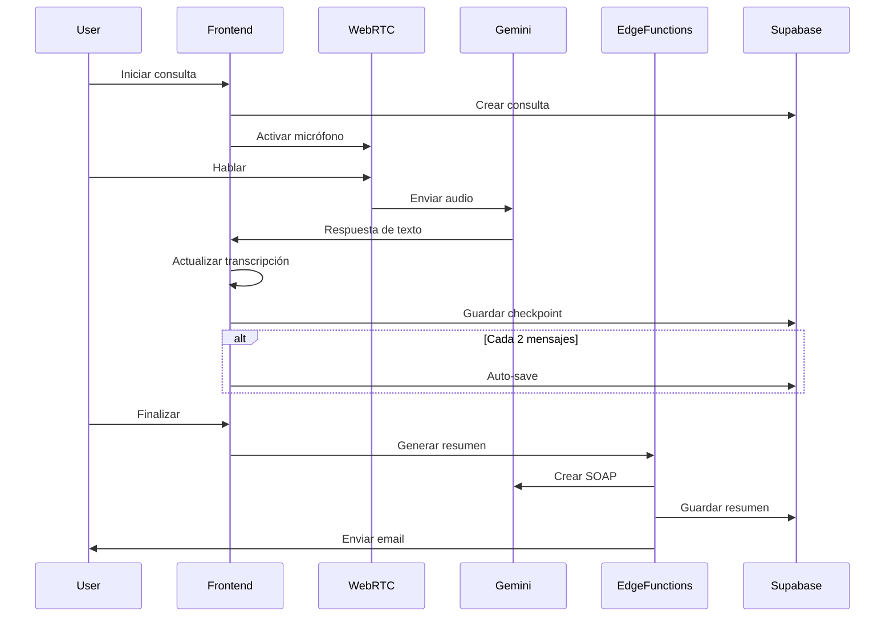

# Arquitectura del Sistema - Cabo Health Nova

> Documentación técnica de la arquitectura del sistema

## 🏗️ Visión General

Cabo Health Nova sigue una arquitectura **JAMstack (JavaScript, APIs, Markup)** con un frontend React moderno y un backend como servicio (BaaS) usando Supabase.

### Diagrama de Arquitectura

```
┌─────────────────┐    ┌──────────────────┐    ┌─────────────────┐
│                 │    │                  │    │                 │
│   Frontend      │    │   Supabase       │    │   External APIs │
│   (React/Vite)  │◄──►│   (BaaS)         │◄──►│   (Gemini AI)   │
│                 │    │                  │    │                 │
└─────────────────┘    └──────────────────┘    └─────────────────┘
        │                       │                       │
        │              ┌──────────────────┐              │
        └──────────────►│   Edge Functions │◄─────────────┘
                       │   (Deno Runtime) │
                       └──────────────────┘
```

## 🖥️ Frontend Architecture

### Core Technologies

- **React 18.3** - Biblioteca de UI con Concurrent Features
- **TypeScript 5.6** - Tipado estático para seguridad
- **Vite 6.2** - Build tool con HMR instantáneo
- **TailwindCSS** - Framework CSS utility-first
- **Radix UI** - Componentes headless accesibles

### Estructura de Componentes

```
src/
├── components/
│   ├── AuthForm.tsx          # Formulario de autenticación
│   ├── Header.tsx            # Encabezado con logout
│   ├── ControlPanel.tsx      # Controles de audio
│   ├── TranscriptionPanel.tsx # Panel de transcripción
│   ├── SummaryPanel.tsx      # Panel de resumen SOAP
│   ├── SessionRecoveryModal.tsx # Modal de recuperación
│   ├── ProgressIndicator.tsx # Indicador de progreso
│   └── [ otros componentes ]
├── contexts/
│   └── AuthContext.tsx       # Estado de autenticación
├── lib/
│   └── supabase.ts          # Cliente de Supabase
├── services/
│   ├── audioService.ts      # Servicio de audio WebRTC
│   └── summaryQueue.ts      # Cola de generacion de resumenes
└── utils/
    ├── audioUtils.ts        # Utilidades de audio
    └── sanitizeHtml.ts      # Sanitización HTML
```

### Estado Management

```typescript
// Context API para estado global
interface AuthContextType {
  user: User | null;
  loading: boolean;
  signIn: (email: string, password: string) => Promise<void>;
  signUp: (email: string, password: string) => Promise<void>;
  signOut: () => Promise<void>;
}

// Estado local con hooks
const [transcript, setTranscript] = useState<string[]>([]);
const [isRecording, setIsRecording] = useState(false);
const [currentSession, setCurrentSession] = useState<Session | null>(null);
```

### Audio System Architecture

```
Microphone ──WebRTC──► AudioBuffer ──Gemini API──► Text Response
     │                                             │
     └─────── Real-time Visualization ──────────────┘
```

**Componentes del Sistema de Audio**:
- **WebRTC**: Captura audio nativo del micrófono
- **AudioBuffer**: Buffer circular para streaming
- **Gemini Native Audio**: Procesamiento directo audio→texto
- **Real-time Visualization**: Ondas de audio en UI

## 🗄️ Backend Architecture (Supabase)

### Database Schema

```sql
-- Diagrama de relaciones
patients (1) ──► (N) consultations
consultations (1) ──► (N) transcriptions
consultations (1) ──► (N) summaries
consultations (1) ──► (1) sessions
consultations (1) ──► (N) session_checkpoints
sessions (1) ──► (1) pending_summaries
```

#### Tablas Principales

**1. patients**
```sql
CREATE TABLE patients (
  id UUID PRIMARY KEY DEFAULT gen_random_uuid(),
  user_id UUID REFERENCES auth.users(id),
  full_name TEXT NOT NULL,
  date_of_birth DATE,
  email TEXT,
  created_at TIMESTAMPTZ DEFAULT NOW()
);
```

**2. consultations**
```sql
CREATE TABLE consultations (
  id UUID PRIMARY KEY DEFAULT gen_random_uuid(),
  user_id UUID REFERENCES auth.users(id),
  patient_id UUID REFERENCES patients(id),
  session_id UUID UNIQUE NOT NULL,
  language TEXT CHECK (language IN ('es', 'en')),
  status TEXT DEFAULT 'active',
  created_at TIMESTAMPTZ DEFAULT NOW(),
  completed_at TIMESTAMPTZ
);
```

**3. transcriptions**
```sql
CREATE TABLE transcriptions (
  id UUID PRIMARY KEY DEFAULT gen_random_uuid(),
  consultation_id UUID REFERENCES consultations(id),
  sender TEXT CHECK (sender IN ('user', 'nova')),
  text TEXT NOT NULL,
  language TEXT,
  timestamp TIMESTAMPTZ DEFAULT NOW(),
  audio_url TEXT
);
```

**4. summaries**
```sql
CREATE TABLE summaries (
  id UUID PRIMARY KEY DEFAULT gen_random_uuid(),
  consultation_id UUID REFERENCES consultations(id),
  html_content TEXT NOT NULL,
  generated_at TIMESTAMPTZ DEFAULT NOW(),
  sent_at TIMESTAMPTZ,
  doctor_email TEXT
);
```

**5. session_checkpoints**
```sql
CREATE TABLE session_checkpoints (
  id UUID PRIMARY KEY DEFAULT gen_random_uuid(),
  user_id UUID REFERENCES auth.users(id),
  consultation_id UUID REFERENCES consultations(id),
  session_id UUID NOT NULL,
  patient_name TEXT NOT NULL,
  transcript JSONB NOT NULL,
  message_count INTEGER NOT NULL,
  created_at TIMESTAMPTZ DEFAULT NOW()
);
```

**6. pending_summaries** (Cola de Resumenes Asincrona)
```sql
CREATE TABLE pending_summaries (
  id UUID PRIMARY KEY DEFAULT gen_random_uuid(),
  session_id TEXT NOT NULL UNIQUE,
  user_id UUID REFERENCES auth.users(id) ON DELETE CASCADE,
  transcript JSONB NOT NULL,
  patient_name TEXT,
  language TEXT NOT NULL DEFAULT 'es',
  session_duration INTEGER,
  status TEXT DEFAULT 'pending' CHECK (status IN ('pending', 'processing', 'completed', 'failed')),
  summary TEXT,
  error_message TEXT,
  attempts INTEGER DEFAULT 0,
  created_at TIMESTAMPTZ DEFAULT now(),
  updated_at TIMESTAMPTZ DEFAULT now(),
  processed_at TIMESTAMPTZ
);
```

**Proposito de pending_summaries**: Esta tabla actua como cola de procesamiento para garantizar que los transcripts de entrevistas NUNCA se pierdan. Al finalizar una sesion, el transcript se guarda PRIMERO en esta tabla antes de iniciar la generacion del resumen con IA. Si la generacion falla, el transcript permanece seguro para reintentos posteriores.

### Row Level Security (RLS)

```sql
-- Ejemplo de política RLS
CREATE POLICY "Users can only access their own data" ON patients
  FOR ALL USING (auth.uid() = user_id);

CREATE POLICY "Service role can access all data" ON patients
  FOR ALL USING (auth.role() = 'service_role');
```

### Edge Functions Architecture

```
┌─────────────────────────────────────────────────┐
│               Edge Functions                    │
│  (Deno Runtime - Serverless)                    │
├─────────────────────────────────────────────────┤
│                                                 │
│  ┌─────────────────┐  ┌─────────────────────┐  │
│  │  save-consult.  │  │   generate-summary  │  │
│  │  - Save data    │  │   - Gemini AI       │  │
│  │  - Validate     │  │   - SOAP format     │  │
│  └─────────────────┘  └─────────────────────┘  │
│                                                 │
│  ┌─────────────────┐  ┌─────────────────────┐  │
│  │ send-summary    │  │  get-consultations  │  │
│  │ - Resend API    │  │   - User history    │  │
│  │ - Email templ.  │  │   - Pagination      │  │
│  └─────────────────┘  └─────────────────────┘  │
└─────────────────────────────────────────────────┘
```

## 🔄 Data Flow

### 1. Flujo de Consulta Completa



### 2. Flujo de Persistencia

```
┌─────────────────┐
│   Usuario       │
│   Habla         │
└──────┬──────────┘
       │
       ▼
┌─────────────────┐    ┌─────────────────┐
│   Frontend      │────►  localStorage  │
│   Estado Local  │    │  (Instantáneo)  │
└──────┬──────────┘    └────────────────┘
       │
       ▼
┌─────────────────┐
│   Edge Function │
│   save-checkpoint │
└──────┬──────────┘
       │
       ▼
┌─────────────────┐    ┌─────────────────┐
│   Supabase      │◄───│  session_       │
│   Database      │    │  checkpoints    │
└─────────────────┘    └────────────────┘
```

## 🔧 Arquitectura de Audio

### WebRTC Integration

```typescript
// Configuración de WebRTC
const audioConfig = {
  echoCancellation: true,
  noiseSuppression: true,
  autoGainControl: true,
  sampleRate: 16000,
  channelCount: 1,
  volume: 1.0
};

// Flujo de audio
Microphone → MediaRecorder → AudioBuffer → Gemini API
                ↓
         Real-time Visualization
```

### Gemini Native Audio

```typescript
// Configuracion de Gemini para audio (conversacion)
const geminiConfig = {
  model: 'gemini-2.0-flash-exp',
  generationConfig: {
    temperature: 0.7,
    topK: 1,
    topP: 1,
    maxOutputTokens: 2048,
  },
  systemInstruction: {
    parts: [
      {
        text: `Eres Nova, una asistente medica especializada en entrevistas clinicas.
               Usa un tono profesional pero amigable.`
      }
    ]
  }
};
```

### Generacion de Resumenes SOAP

El sistema utiliza una estrategia de modelo primario con fallback para generar resumenes clinicos:

```typescript
// Modelo primario: Gemini 3 Flash con thinking
const primaryConfig = {
  model: 'gemini-3-flash-preview',
  thinkingLevel: 'HIGH',  // ThinkingLevel del SDK @google/genai
  timeout: 120000,        // 120 segundos
};

// Fallback: Gemini 2.5 Flash
const fallbackConfig = {
  model: 'gemini-2.5-flash',
  timeout: 120000,
};
```

**Razon del cambio**: Gemini 2.5 Pro tenia thinking mode obligatorio que causaba timeouts de mas de 180 segundos. Gemini 3 Flash es 3x mas rapido y tiene mejor calidad en benchmarks.

## 🔐 Seguridad Architecture

### Authentication Flow

```
┌─────────────┐    ┌─────────────┐    ┌─────────────┐
│   Usuario   │    │  Supabase   │    │  Frontend   │
│  Login/Reg  │────►   Auth      │────►   Context  │
└─────────────┘    └─────────────┘    └─────────────┘
                            │
                            ▼
                   ┌─────────────┐
                   │    JWT      │
                   │   Token     │
                   └─────────────┘
```

### RLS Implementation

```sql
-- Política por defecto: Denegar todo
ALTER TABLE patients ENABLE ROW LEVEL SECURITY;

-- Permitir acceso solo al propietario
CREATE POLICY "Users own data" ON patients
  FOR ALL USING (auth.uid() = user_id);

-- Permitir acceso a Edge Functions
CREATE POLICY "Service role access" ON patients
  FOR ALL USING (auth.role() = 'service_role');
```

### Sanitization Layer

```typescript
// DOMPurify configuration
const sanitizationConfig = {
  ALLOWED_TAGS: [
    'h1', 'h2', 'h3', 'h4', 'h5', 'h6',
    'p', 'strong', 'em', 'u', 's',
    'ul', 'ol', 'li',
    'a', 'table', 'tr', 'td', 'th',
    'br', 'hr'
  ],
  ALLOWED_ATTR: ['href', 'class', 'id', 'colspan', 'rowspan']
};
```

## 📊 Performance Architecture

### Bundle Optimization

```typescript
// Vite configuration
export default defineConfig({
  build: {
    rollupOptions: {
      output: {
        manualChunks: {
          vendor: ['react', 'react-dom'],
          supabase: ['@supabase/supabase-js'],
          ui: ['@radix-ui/react-dialog', '@radix-ui/react-progress']
        }
      }
    },
    chunkSizeWarningLimit: 1000
  }
});
```

### Caching Strategy

```
┌─────────────────┐
│   Browser Cache │
│   - Static JS   │
│   - CSS         │
└────────┬────────┘
         │
         ▼
┌─────────────────┐    ┌─────────────────┐
│   CDN Cache     │    │   API Cache     │
│   - Images      │    │   - Supabase    │
│   - Fonts       │    │   - Gemini      │
└─────────────────┘    └─────────────────┘
```

### Audio Optimization

```typescript
// Audio buffer management
const audioOptimization = {
  bufferSize: 4096,
  sampleRate: 16000,
  chunkSize: 1024,
  compression: 'none', // Lossless para mejor calidad médica
  streaming: true
};
```

## 🌐 Deployment Architecture

### Environment Strategy

```
┌─────────────────┐
│   Development   │
│   - Local .env  │
│   - npm run dev │
└────────┬────────┘
         │
         ▼
┌─────────────────┐
│   Production    │
│   - Platform    │
│   - Variables   │
│   - Auto-deploy │
└─────────────────┘
```

### Monitoring Stack

```
┌─────────────────┐    ┌─────────────────┐
│   Application   │    │   Supabase      │
│   - Console     │    │   - Logs        │
│   - ErrorBound. │    │   - Metrics     │
└────────┬────────┘    └────────┬────────┘
         │                     │
         ▼                     ▼
┌─────────────────┐    ┌─────────────────┐
│   Performance   │    │   Alerts        │
│   - Bundle size │    │   - 500 errors  │
│   - Load time   │    │   - Latency     │
└─────────────────┘    └─────────────────┘
```

## 🔄 Scalability Considerations

### Horizontal Scaling

- **Frontend**: Stateless, fácil escalado con CDN
- **Edge Functions**: Serverless, auto-scaling
- **Database**: Supabase maneja connection pooling
- **Storage**: CDN automático para assets

### Database Scaling

```sql
-- Índices para performance
CREATE INDEX idx_consultations_user_id ON consultations(user_id);
CREATE INDEX idx_transcriptions_consultation_id ON transcriptions(consultation_id);
CREATE INDEX idx_session_checkpoints_user_id ON session_checkpoints(user_id);
```

### API Rate Limiting

```typescript
// Edge Function rate limiting
const rateLimiting = {
  windowMs: 15 * 60 * 1000, // 15 minutos
  max: 100, // requests por IP
  message: 'Too many requests'
};
```

## 🎯 Patrones de Diseño

### 1. Provider Pattern

```typescript
// AuthProvider
function AuthProvider({ children }: { children: ReactNode }) {
  const value = useAuth();
  return <AuthContext.Provider value={value}>{children}</AuthContext.Provider>;
}
```

### 2. Hook Pattern

```typescript
// Custom hooks para lógica reusable
function useAudioRecording() {
  const [isRecording, setIsRecording] = useState(false);
  const [audioData, setAudioData] = useState<Float32Array[]>([]);
  
  const startRecording = useCallback(async () => {
    // implementation
  }, []);
  
  return { isRecording, audioData, startRecording, stopRecording };
}
```

### 3. Service Layer Pattern

```typescript
// Servicios abstractos
interface AudioService {
  startRecording(): Promise<void>;
  stopRecording(): Promise<Float32Array>;
  sendToGemini(audio: Float32Array): Promise<string>;
}

// Implementación
class WebRTCAudioService implements AudioService {
  // implementation
}
```

---

*Documentacion tecnica completa disponible*
*Ultima actualizacion: 2026-01-23*